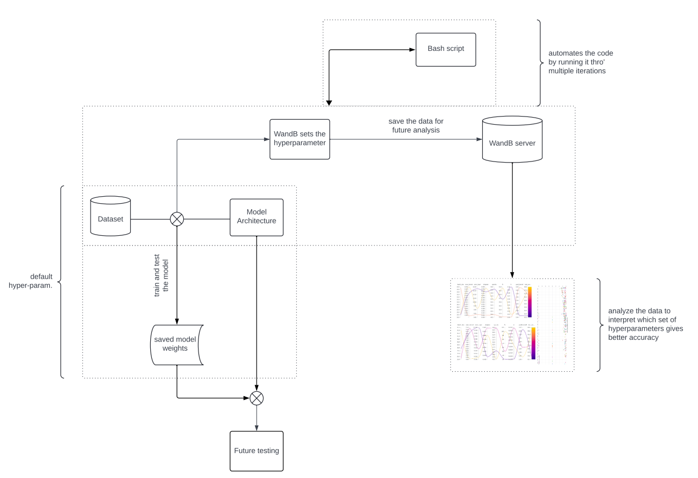
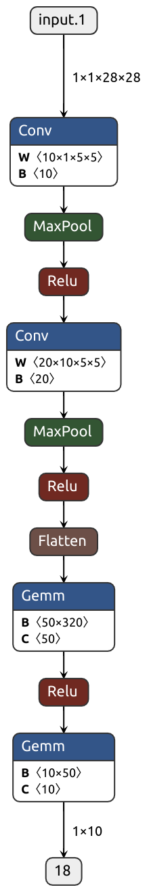
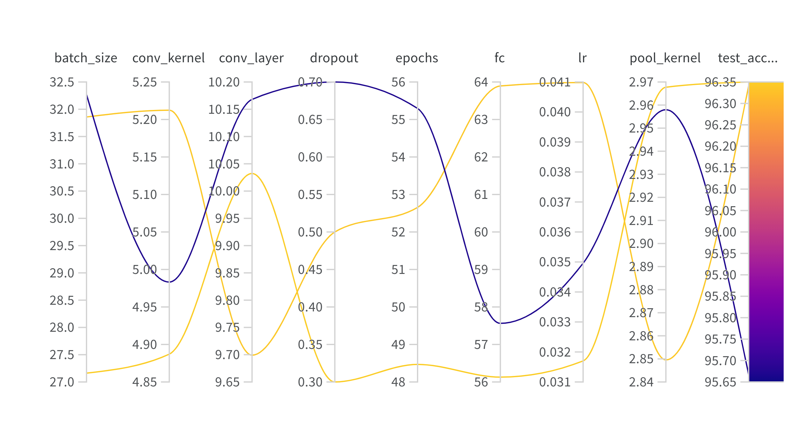
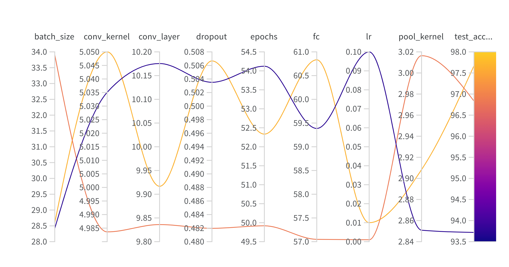
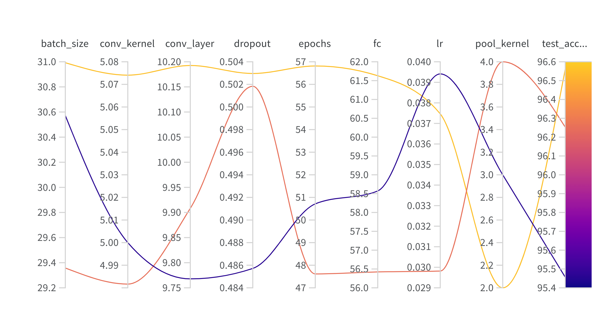
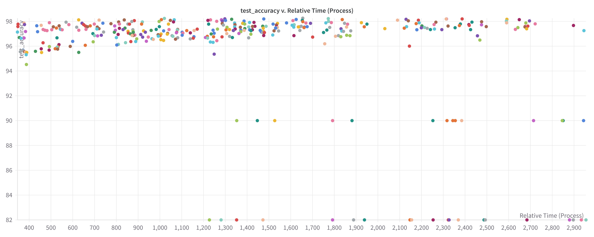

# Recognition using Deep Networks

## Table of Contents

1. [Introduction](#Introduction)
2. [How it works?](#how_it_works)
3. [Results](#Results)

## Introduction
While working on this project we were completely focused on the digits MNIST data set while 
focusing on several deep learning tasks. The initial stage of this project teaches us about building, 
training, understanding and improving/make changes to a deep neural network using PyTorch and 
torchvision. We start by plotting example digits and designing a network with specific layers like 
convolutional layers, max pooling layers, dropout layers and fully connected layers with appropriate
activations. Moving on ahead in this project we train the model which involves optimizing the 
model over epochs, evaluating performance on training and test sets and saving the trained 
network for further tasks.

Moving on to the successive task, we get involved with network analysis by examining the structure 
of the network, visualizing filters, and understanding how the filters affect the image data. The 
project then extends to transfer learning on Greek letters, where we use the trained network for a 
new recognition task.

Lastly, task 4 asks us to design our own experiments to explore various dimensions of the network 
architecture and optimization strategies, aiming to improve performance and training efficiency.
This project covers fundamental aspects of deep learning, from model building and training to 
analysis, transfer learning, and experimentation, providing a solid foundation for understanding and 
working with neural networks.

### Development Environment
- **Operating System:** Ubuntu 22.04
- **IDE:**  PyCharm

### Team Members
- Arun Srinivasan V K
- Abhinav Anil

### Languages used
- Python
- Bash

### Libraries used
- torch
- torchvision
- Numpy
- OpenCV
- Matplotlib
- sys
- os
- Wandb

### Softwares used
- WandB
- Netron (onnx)

## How it works?

## Results

<em> Fig 1. Model Architecture. </em>

<em> Fig 2. Analysis of hyper-parameter values (conv_kernel) </em>

<em> Fig 3. Analysis of hyper-parameter values (conv_layer) </em>

<em> Fig 4. Analysis of hyper-parameter values (batch_size) </em>

<em> Fig 5. Analysis of hyper-parameter values (dropout) </em>

<em> Fig 6. Analysis of hyper-parameter values (epochs) </em>

<em> Fig 7. Analysis of hyper-parameter values (fc) </em>

<em> Fig 8. Analysis of hyper-parameter values (lr) </em>

<em> Fig 9. Analysis of hyper-parameter values (pool_kernel) </em>

<em> Fig 10. Analysis of hyper-parameter values (test_acc) </em>

